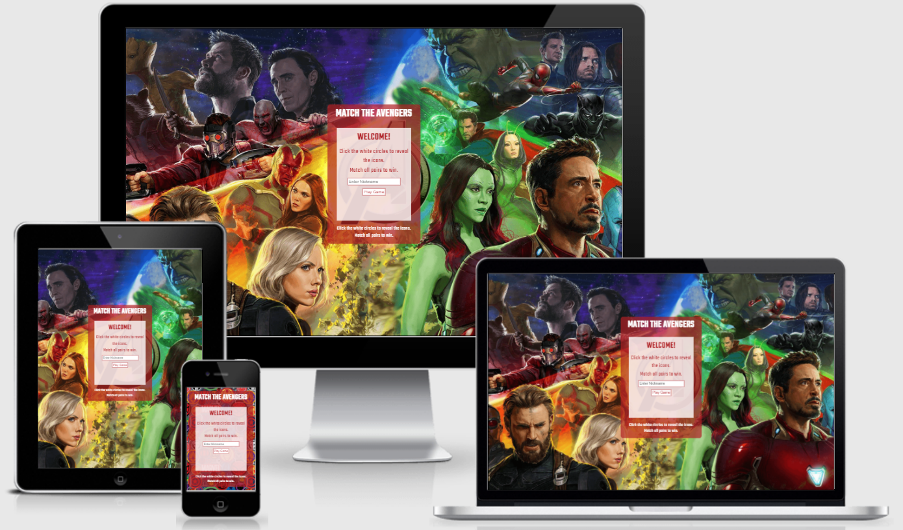
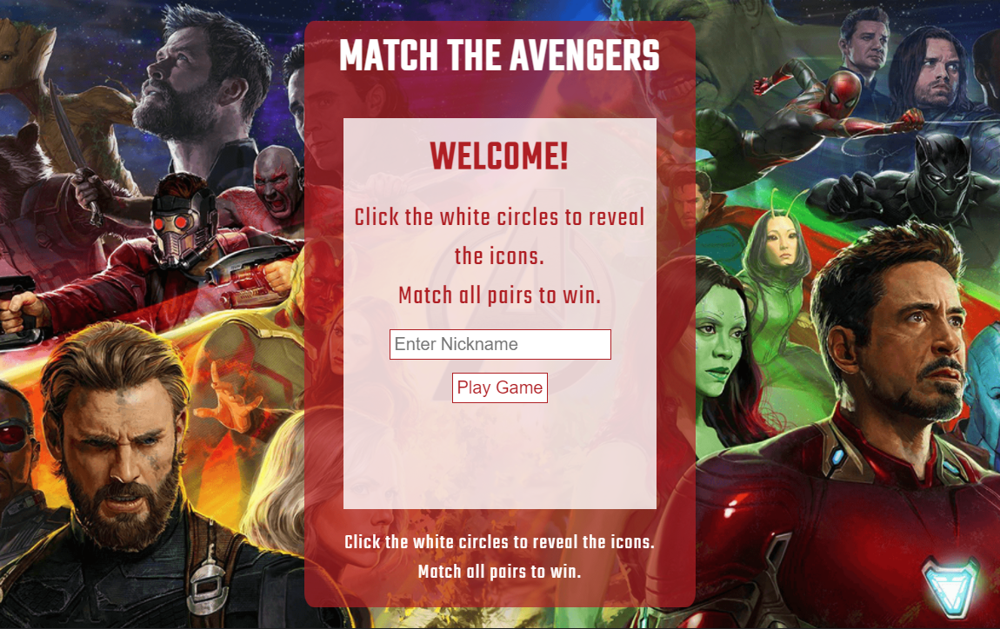
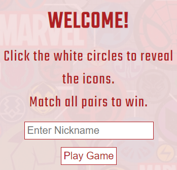
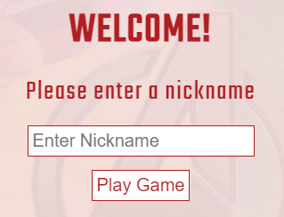
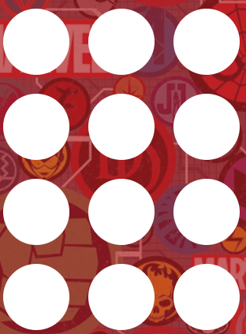
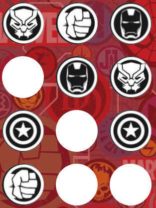
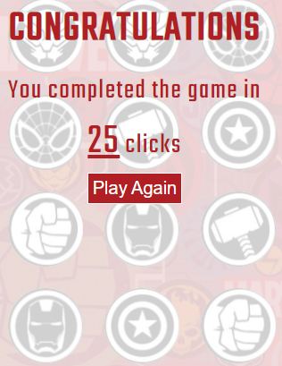
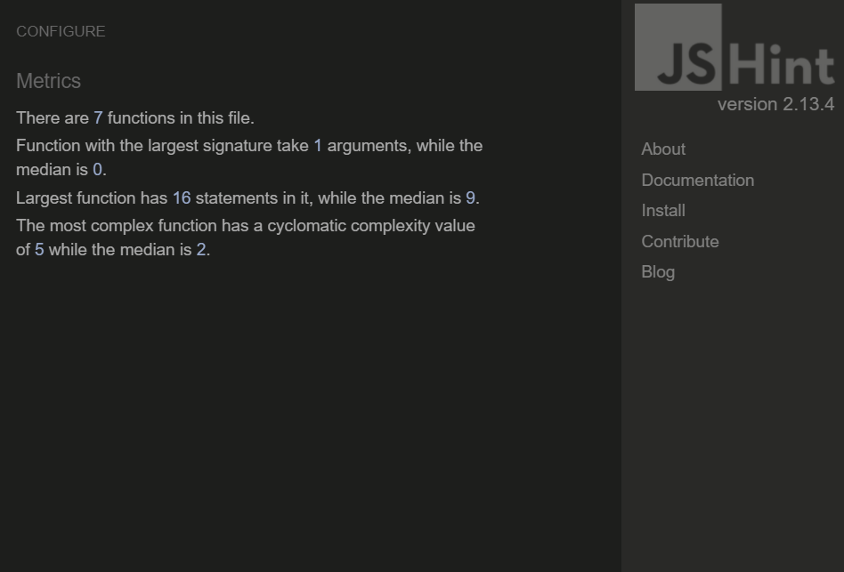

# Avengers Pairs

Avengers Pairs is an interactive website for Marvel's Avengers fans of all ages. The website offers a simple but entertaining memory game that users can play as many times as they wish.

The website users will be able to enter a nickname and play the game. Once complete the user will be able to see how many attempts it took them to match all 6 pairs of Avengers icons. They will also be able to play again if they wish. 

Link to deployed website - [Avengers Pairs](https://aemacbeath.github.io/avengers-pairs/)

## Table of Contents

1. [User Stories](#user-stories)
2. [Features](#features)
    - [Consistant Features](#consistant-features)
    - [Welcome Screen](#welcome-screen)
    - [Enter Nickname Reminder](#enter-nickname-reminder)
    - [Game Screen](#game-screen)
    - [Game Complete](#game-complete)
3. [Technologies Used](#technologies-used)
4. [Testing](#testing)
    - [Bugs](#bugs)
    - [Validator Testing](#validator-testing)
5. [Deployment](#deployment)
6. [Credits](#credits)
7. [Future Development]()

## User Stories

As a user of this site I can
- enter a nickname
- play the memory game
- see how many clicks it took to complete the game
- restart the game

## Features

## Consistent Features

The below features remain the same throughout the game. 
- The background image
    - on small devices this is an image of various Avengers icons. 
    - on medium to large devices this is a picture of the Marvel Cinematic Universe characters.
- A heading - MATCH THE AVENGERS at the top of the red section.
- Game instructions at the bottom of the red section. 

The below screen shots show all these features on small and medium / large devices. 

**Small devices** 

**Medium / Large devices** 

## Welcome Screen

The welcome screen consists of the following elements as shown in the below screenshot.
- A WELCOME! heading.
- Game instructions.
- An input section for users to add a nickname of their choice.
- A Play Game button to begin the game.

**Welcome Screen on all device sizes** 

## Enter nickname reminder
A message to ask users to enter a nickname if left blank on the welcome screen. 

## Game screen

At the start, the game screen contains 12 white circles, as shown in the below screenshot. 

When a white circle is clicked an Avengers icon will appear. If a pair is found the icons remain in place of the white circle, as shown below. 

## Game complete

The game complete screen contains
- a congratulations heading.
- a count of how many clicks it took the user to complete the game.
- a Play Again button to restart the game.

**Game complete screen on all device sizes** 

## Technologies used

- HTML
- CSS
- Javascript
- GitHub
- GitPod
- Microsoft Snipping Tool

## Testing

## Bugs

- Images did not load in deployed version. Removed ../ from start of file path to correct the error.
- White bar appeared at the bottom of the screen on large devices. Changed background-image to fixed.

## Validator Testing
- HTML - No errors returned when passing through the [W3C HTML Validator](https://validator.w3.org/nu/?doc=https%3A%2F%2Faemacbeath.github.io%2Favengers-pairs%2F).
- CSS - No errors returned when passing through the [W3C CSS Validator (Jigsaw)](https://jigsaw.w3.org/css-validator/validator?uri=https%3A%2F%2Faemacbeath.github.io%2Favengers-pairs%2F&profile=css3svg&usermedium=all&warning=1&vextwarning=&lang=en).
- Javascript - No errors found using [Jshint](https://jshint.com/) as shown in the below screen shot.

- Accessibility
    - All font used is easy to read and contrasts with background colors.
    - This has been tested using Lighthouse in devtools.

## Deployment

This site was deployed to GitHub pages by following the below steps:

- In the GitHub repository navigate to settings
- Select the Pages tab from the menu
- Select the main branch from the source section drop down
- Click Save to generate a link to the completed website
- Link to deployed website - [Avengers Pairs](https://aemacbeath.github.io/avengers-pairs/)

## Credits

- Medium / Large devices background image is taken from [itl.cat](https://www.itl.cat/wallview/iibTmxi_because-no-one-has-a-screen-wallpaper-single/).
- Small devices background image is from [wallpapercave.com](https://wallpapercave.com/w/wp9535327).
- The Avengers Icons used in the game are from [vectorified.com](https://vectorified.com/download-image#heroes---icon-9.jpg).
    - Icons where cropped using Microsoft Snipping Tool. 

## Future Development

- Add a scoreboard to show users how their score stacks up with other players.