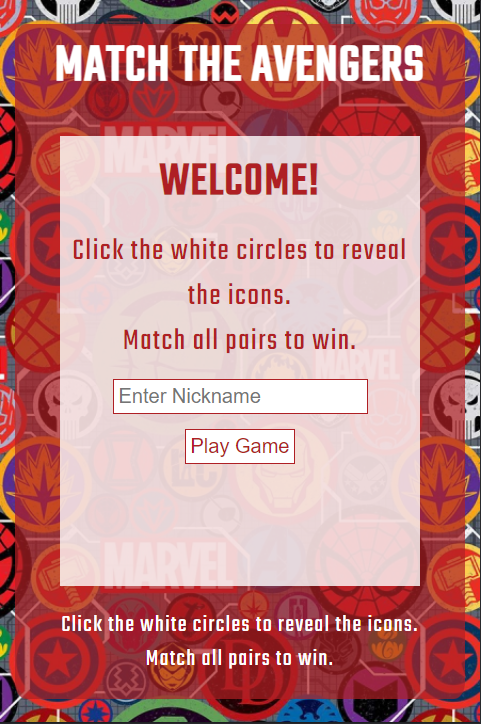

# Avengers Pairs

Avengers Pairs is an interactive website for Marvel's Avengers fans of all ages. The website offers a simple but entertaining memory game that users can play as many time as they wish.

The website users will be able to enter a nickname and play the game. Once complete the user will be able to see how many attempts it took them to match all 6 pairs of Avengers icons. They will also be able to play again if they wish. 

Link to deplyed website - [Avengers Pairs](https://aemacbeath.github.io/avengers-pairs/)

## Table of Contents

1. [User Stories](#user-stories)
2. [Features](#features)
3. Testing
4. Deployment
5. Credits
6. Technologies Used

## User Stories

- As a user of this site i can
    - enter a nickname
    - play the memory game
    - 

## Features

### Consistant Features

The below features remain the same throughout the game. 
- The background image
    - on small devices this is an image of various Avengers icons. 
    - on medium to large devices this is a picture of the Marvel Cinematic Universe characters.
- A heading - MATCH THE AVENGERS at the top of the red section.
- Game instuctions at the bottom of the red section. 

The below screen shots show all these features on small and medium / large devices. 

**Small devices** 

**Medium / Large devices** 

### Welcome Screen

The welcome screen consists of the following elements as shown in the below screenshot.
- A WELCOME! heading.
- Game instructions.
- An input section for users to add a nickname of their choice.
- A Play Game button to begin the game.

**Welcome Screen on all device sizes** 

### Enter nickname reminder

### Game screen

At the start, the game screen contains 12 white circes, as shown in the below screenshot. 

When a white circle is clicked an Avengers icon will appear. If a pair is found the icons remain in place of the white circle, as shown below. 

### Game complete

The game complete screen contains
- a congratulations heading.
- a count of how many clicks it took the user to complete the game.
- a Play Again button to restart the game.

**Game complete screen on all device sizes** 

<!-- bugs = images don't load in deployed version. Removed ../ from start of file path.

bugs = if user click 3rd icon before fucntion for 2nd click finishes 1st icon stays visible. Wrapped function in if to stop 3rd click doing anything.

bugs = user can double click one circle to record as pair. id != clickedCard1 -->